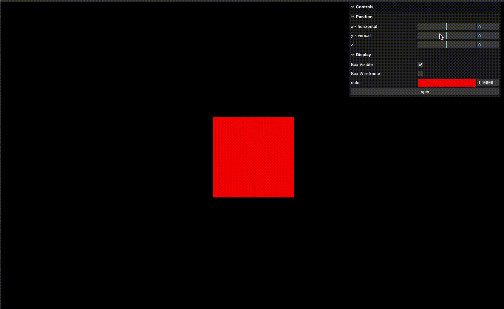
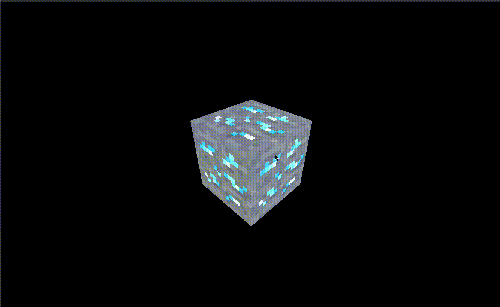
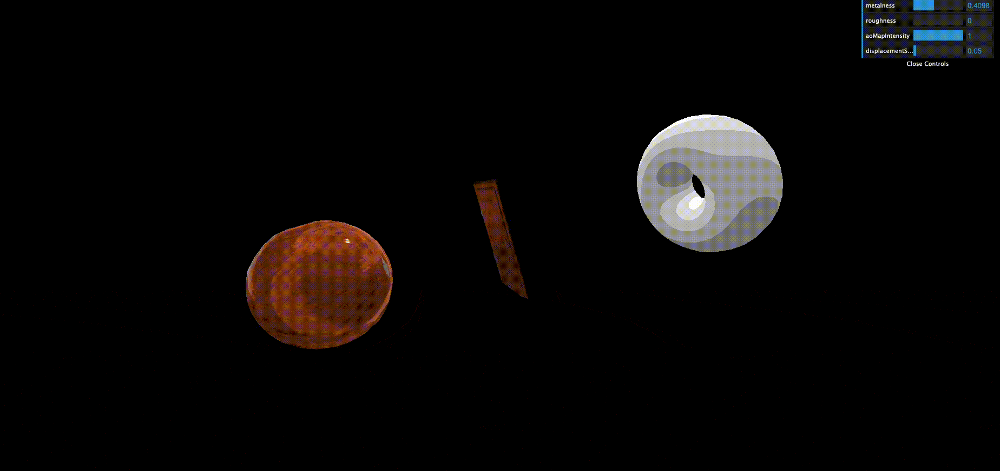
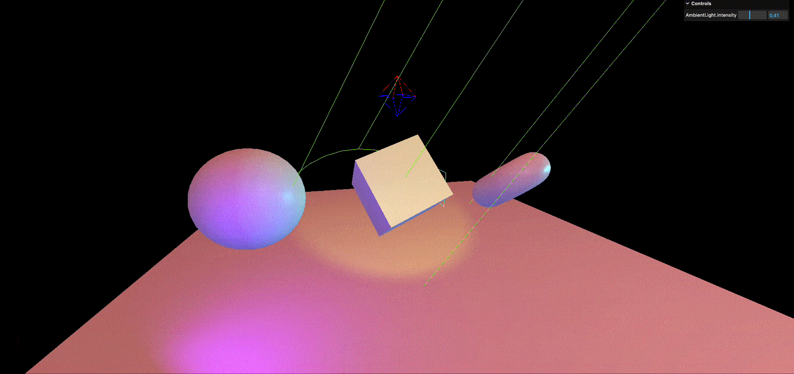
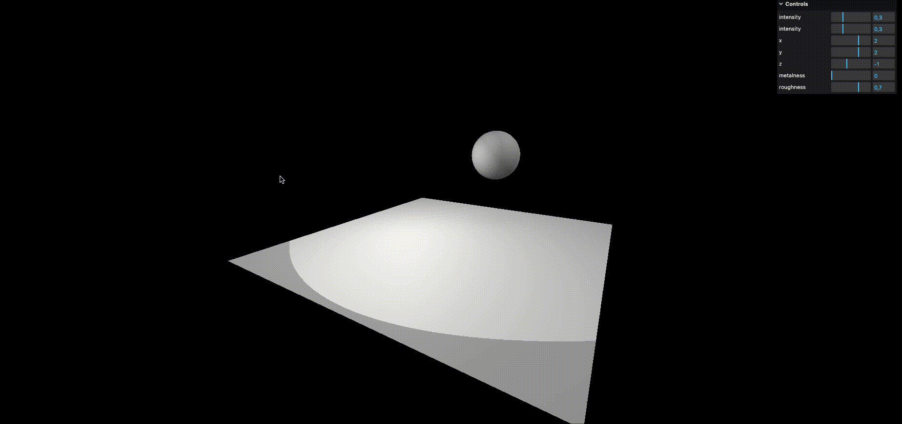

<br/><br/>

# Description

> Lessons from threejs-journey.com course.

This projects contains lessons from threejs-journey.com, and some of my own three.js / webgl experiments aswell.

## Status

- [x] _in progress_
- [ ] _finished_
- [ ] _no longer continued_

_this application is currently beeing developed_

## Table of contents

- [Description](#description)
- [Status](#status)
- [Table of contents](#table-of-contents)
- [General Info](#general-info)
- [Screenshots](#screenshots)
- [Technologies](#technologies)
- [Setup](#setup)
- [Known Issues](#known-issues)

## General Info

This Project aims to help me learn about three.js and webgl.

---

</br></br></br>

## Screenshots










## Technologies

Main Technologies used in the project:

- Three.js
  - Webgl

## Setup

Run, to see a message:

```
yarn start
```

```
Project running at:
  - http://[local-ip]:8080
```

Navigate to the subfolder you want to view. eg. '/01-basic'.

## Known Issues

-
